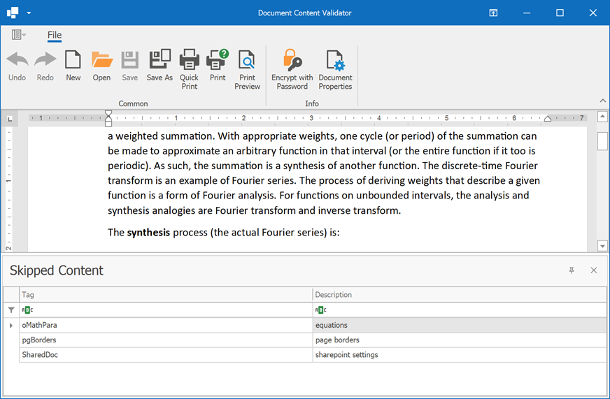

# Rich Text Editor – Document Content Validator

This application allows you to check whether your DOCX or RTF document contains tags ignored by the Rich Text Editor when it displays the document. 

Run the application and open your document. The **Skipped Content** table displays skipped tags that can affect document content and appearance.

**Note:** We are continually updating our **Document Content Validator** app. If it did not help you identify the issue with your document, [submit a ticket to our Support Center](https://supportcenter.devexpress.com/ticket/create). Attach your document to the ticket and describe the steps needed to reproduce your issue. We will examine your document for unsupported tags and update our **Document Content Validator**.
